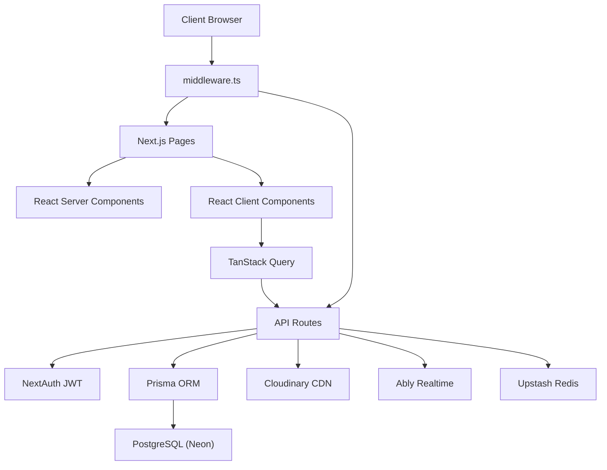
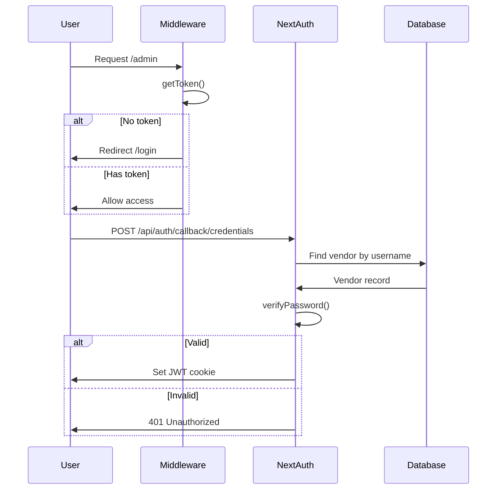
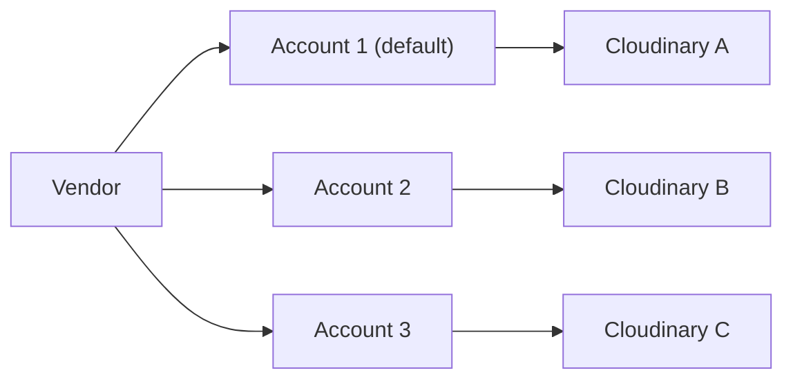

## System Overview

Hafiportrait Platform mengikuti pola **Next.js App Router** dengan clear separation antara server dan client code.

## Auth Flow

## API Architecture

### Public Routes (Token-based)

Client mengakses galeri via token unik, bukan login:

| Route | Method | Description |
|-------|--------|-------------|
| `/api/public/gallery/[token]` | GET | Ambil data galeri + foto |
| `/api/public/gallery/[token]/count` | GET | Jumlah seleksi foto |
| `/api/public/gallery/[token]/submit` | POST | Submit seleksi foto |
| `/api/public/gallery/[token]/notify` | POST | Kirim notifikasi ke admin |
| `/api/public/booking` | GET/POST | Public booking form |
| `/api/public/invoice/[kodeBooking]` | GET | Lihat invoice |

### Admin Routes (Auth Required)

Semua route di `/api/admin/*` dilindungi oleh:
1. **Middleware** — cek JWT token
2. **Ownership check** — verifikasi resource milik vendor yang login

| Route | Method | Description |
|-------|--------|-------------|
| `/api/admin/bookings/[id]` | GET/PATCH | Detail & update booking |
| `/api/admin/clients` | GET/POST/PUT/DELETE | CRUD klien |
| `/api/admin/galleries` | GET/POST | List & create galeri |
| `/api/admin/galleries/[id]` | GET/PUT/DELETE | Detail galeri |
| `/api/admin/galleries/[id]/upload` | POST | Upload foto |
| `/api/admin/galleries/[id]/photos` | GET | List foto |
| `/api/admin/galleries/[id]/selections` | GET/PATCH/DELETE | Kelola seleksi |
| `/api/admin/metrics` | GET | Dashboard metrics |
| `/api/admin/packages` | GET/POST | CRUD paket |
| `/api/admin/settings` | GET/PUT | Vendor settings |
| `/api/admin/settings/cloudinary` | GET/POST | Cloudinary accounts |

## Security Layers

<Steps>
  <Step title="Middleware Auth Guard">
    `middleware.ts` melindungi `/admin/*` dan `/api/admin/*`. Unauthenticated request di-redirect ke `/login` atau dapat 401.
  </Step>

  <Step title="Session Validation">
    Setiap API route memanggil `auth()` untuk mendapatkan session. `session.user.id` = vendor ID.
  </Step>

  <Step title="Resource Ownership">
    Helper `verifyBookingOwnership()`, `verifyGalleryOwnership()`, dll memastikan vendor hanya akses resource miliknya.
  </Step>

  <Step title="Input Validation">
    Semua input divalidasi dengan Zod schema sebelum diproses. Response format konsisten via helper `response.ts`.
  </Step>

  <Step title="Rate Limiting">
    Public routes dilindungi rate limiter (Upstash Redis) untuk mencegah spam dan abuse.
  </Step>
</Steps>

## Multi-Tenant Cloudinary

Platform mendukung multiple Cloudinary accounts per vendor:

- API key/secret dienkripsi dengan **AES-256-GCM** sebelum disimpan
- Per-request config — tidak mutasi global state
- Upload, delete, dan list menggunakan credentials per-vendor

## Caching Strategy

| Data | Cache | TTL |
|------|-------|-----|
| Dashboard metrics | `unstable_cache` (Next.js) | 5 menit |
| View count dedup | Redis SETNX | 24 jam |
| Rate limit counters | Redis INCR + EXPIRE | Per-window |

## Error Monitoring

- **Sentry** — server, edge, dan client error tracking
- **Pino** — structured server-side logging
- **ActivityLog** — audit trail di database

<Card title="Database Schema" icon="database" horizontal href="/guides/database">
  Pelajari struktur database dan relasi antar model.
</Card>
