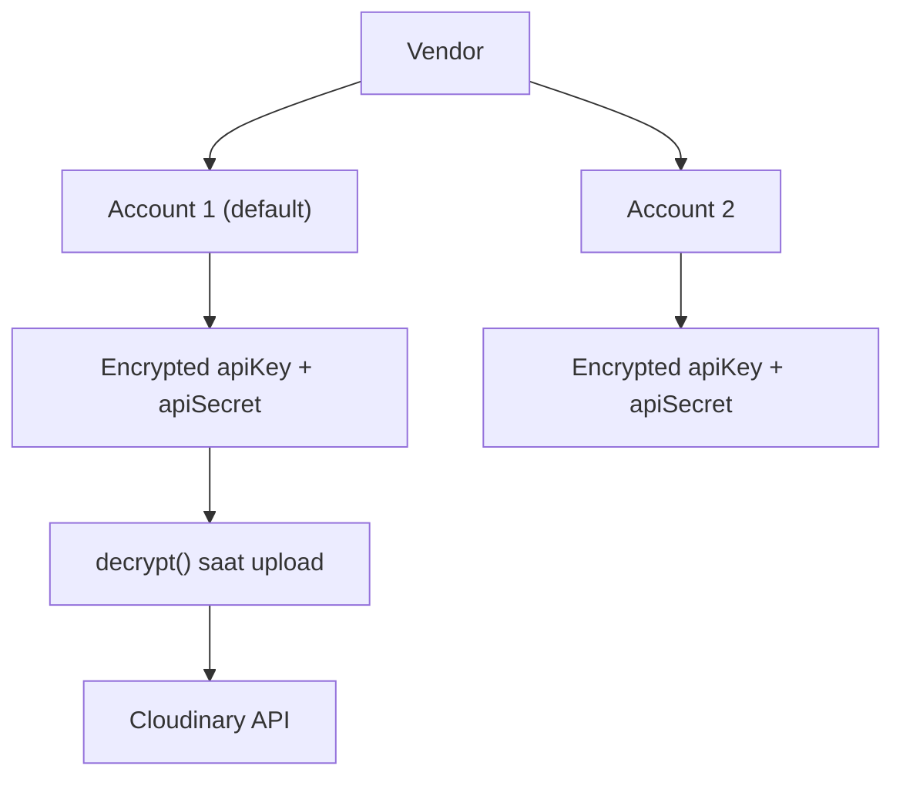

## Overview

Platform menggunakan Cloudinary untuk menyimpan dan serve foto. Mendukung **multiple Cloudinary accounts** per vendor (multi-tenant).

## Multi-Account Architecture

Setiap vendor bisa punya beberapa Cloudinary accounts. API key/secret dienkripsi dengan **AES-256-GCM** sebelum disimpan di database.



## Upload Flow

<Steps>
  <Step title="Admin pilih files">
    Admin upload foto via `/admin/galleries/[id]/upload`.
  </Step>

  <Step title="Validasi">
    - MIME type check
    - File size check (max 15MB per file)
    - Magic bytes verification (cegah file berbahaya)
  </Step>

  <Step title="Upload ke Cloudinary">
    - Batch upload (5 files per batch) untuk hindari OOM
    - Per-request credentials — tidak mutasi global state
    - Chunked upload untuk file > 5MB
  </Step>

  <Step title="Simpan ke Database">
    - `createMany` — satu query untuk semua foto
    - Jika DB gagal, rollback hapus file dari Cloudinary
  </Step>
</Steps>

## Folder Structure

```
galleries/
├── {vendorId}/
│   ├── {galleryId}/
│   │   ├── photo1.jpg
│   │   ├── photo2.jpg
│   │   └── ...
```

## API Usage

### Upload Single Photo

```typescript
import { uploadPhotoToCloudinary } from "@/lib/cloudinary";

const result = await uploadPhotoToCloudinary(
  vendorId,
  buffer,
  filename,
  {
    folder: `galleries/${vendorId}/${galleryId}`,
    accountId: optionalAccountId,
  }
);
```

### Upload Multiple Photos

```typescript
import { uploadMultipleImages } from "@/lib/cloudinary-upload";

const results = await uploadMultipleImages(
  vendorId,
  files,
  {
    folder: `galleries/${vendorId}/${galleryId}`,
    tags: ['gallery', galleryId],
  }
);
```

### Delete Photos

```typescript
import { deletePhotosFromCloudinary } from "@/lib/cloudinary";

const result = await deletePhotosFromCloudinary(vendorId, publicIds);
// result.summary: { total, deleted, failed }
```

## Image Transformations

Platform support beberapa transformasi Cloudinary:

| Transform | Usage |
|-----------|-------|
| `c_fill,g_auto,w_400,h_400` | Thumbnail otomatis |
| `f_auto,q_auto` | Format & quality optimization |
| `e_viesus_correct` | VIESUS AI enhancement |

## VIESUS Enhancement

AI-powered photo enhancement bisa diaktifkan per vendor:

```typescript
// Cek status
const enabled = await isViesusEnhancementEnabled(vendorId);

// Generate enhanced URL
const url = getViesusEnhancedUrl(publicId, {
  cloudName: account.cloudName,
  quality: 'auto',
});
```

<Info>
VIESUS enhancement tidak mengubah foto asli. URL dengan `e_viesus_correct` menghasilkan versi enhanced via CDN transformation.
</Info>
