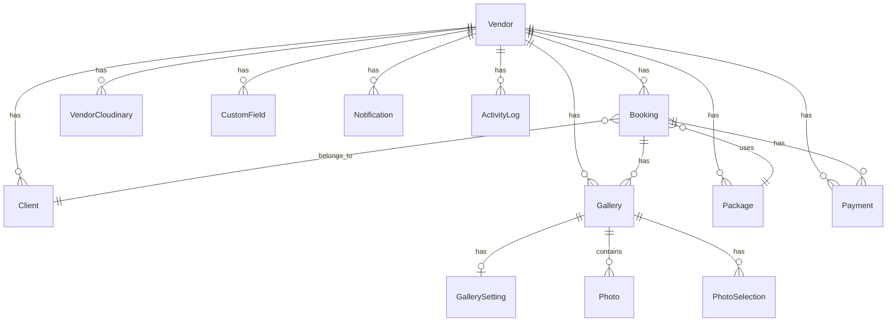

## Provider

PostgreSQL via [Neon](https://neon.com) — serverless PostgreSQL dengan branching support.

## Models

### Vendor

Core entity — fotografer/studio yang memiliki semua resource.

```prisma
model Vendor {
  id                String     @id @default(uuid())
  username          String     @unique
  email             String     @unique
  password          String     // bcrypt hash
  namaStudio        String?
  status            VendorStatus @default(ACTIVE)
  subscriptionType  SubscriptionType @default(VIEWSPACE)
  dpPercentage      Int        @default(30)
  bookingFormActive Boolean    @default(true)
  waAdmin           String?
  // ... dan field lainnya
}
```

### Booking

Sesi foto yang dipesan klien.

```prisma
model Booking {
  id           String        @id @default(uuid())
  vendorId     String
  clientId     String?
  kodeBooking  String        @unique
  namaClient   String
  hpClient     String
  status       BookingStatus @default(PENDING)
  hargaPaket   Decimal?
  dpStatus     DpStatus      @default(UNPAID)
  tanggalSesi  DateTime
  maxSelection Int           @default(40)
}
```

### Gallery

Galeri foto dengan token akses unik untuk klien.

```prisma
model Gallery {
  id            String        @id @default(uuid())
  vendorId      String
  bookingId     String?
  namaProject   String
  clientToken   String        @unique
  status        GalleryStatus @default(DRAFT)
  viewCount     Int           @default(0)
  tokenExpiresAt DateTime?
}
```

### Photo

Foto individual di Cloudinary.

```prisma
model Photo {
  id           String   @id @default(uuid())
  galleryId    String
  storageKey   String   // Cloudinary public ID
  filename     String
  url          String
  thumbnailUrl String?
  width        Int?
  height       Int?
  size         Int?
  urutan       Int      @default(0)

  @@unique([galleryId, storageKey])
}
```

### PhotoSelection

Seleksi foto oleh klien.

```prisma
model PhotoSelection {
  id            String        @id @default(uuid())
  galleryId     String
  fileId        String        // Photo.id
  filename      String
  selectionType SelectionType @default(EDIT)
  isLocked      Boolean       @default(false)
  lockedAt      DateTime?

  @@unique([galleryId, fileId])
}
```

## Relationships



## Enums

| Enum | Values |
|------|--------|
| `BookingStatus` | PENDING, CONFIRMED, COMPLETED, CANCELLED |
| `DpStatus` | UNPAID, PAID, PARTIAL |
| `PaymentType` | DP, PELUNASAN, LAINNYA |
| `PaymentMethod` | CASH, TRANSFER, QRIS, OTHER |
| `GalleryStatus` | DRAFT, IN_REVIEW, DELIVERED |
| `SelectionType` | EDIT, PRINT |
| `FieldType` | TEXT, NUMBER, DATE, SELECT, TEXTAREA |

## Indexes

Setiap model memiliki indexes untuk query yang sering digunakan:

<AccordionGroup>
  <Accordion title="Booking indexes">
    - `vendorId` — list bookings per vendor
    - `vendorId + status` — filter by status
    - `vendorId + tanggalSesi` — upcoming sessions
    - `kodeBooking` — unique, untuk lookup by code
    - `clientId` — bookings per client
  </Accordion>

  <Accordion title="Gallery indexes">
    - `vendorId` — galleries per vendor
    - `bookingId` — gallery per booking
    - `clientToken` — unique, untuk token-based access
    - `status` — filter by status
  </Accordion>

  <Accordion title="Photo indexes">
    - `galleryId + urutan` — ordered photos per gallery
    - `galleryId + storageKey` — unique, prevent duplicates
    - `filename` — search/filter
  </Accordion>
</AccordionGroup>

## Connection Pool

Prisma connection limit di-set via `DATABASE_URL` query param:
- Production: `connection_limit=10`
- Development: `connection_limit=5`

<Info>
Jika tidak ada `connection_limit` di URL, Prisma akan otomatis set berdasarkan `NODE_ENV`.
</Info>
